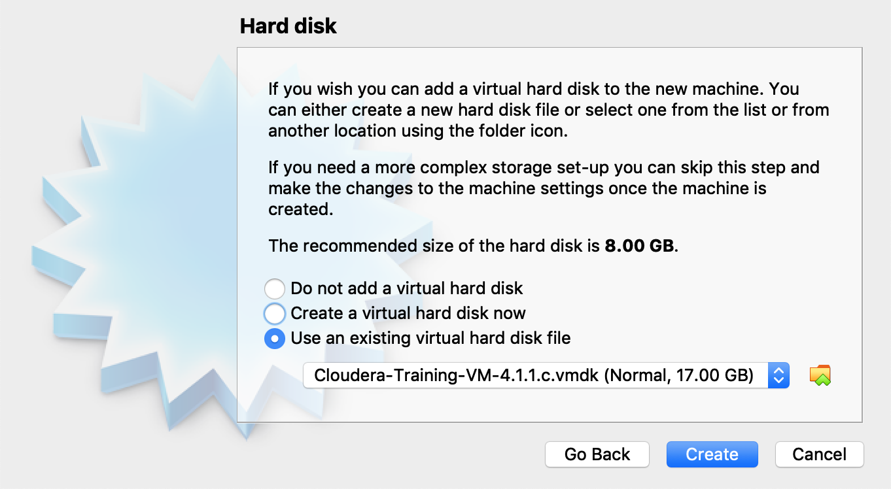
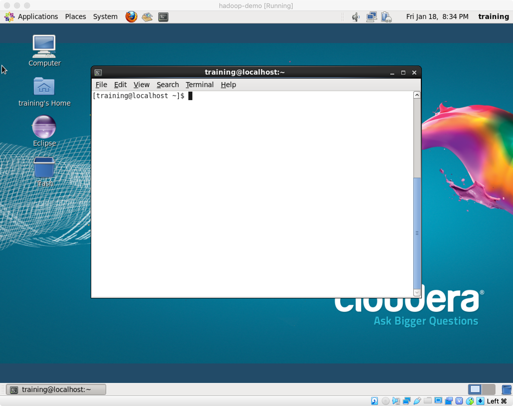

# Lab1 Instruction

-- by Fangyu Gai. Any questions --> fangyu.gai@ubc.ca

---

The purpose of this lab is to grasp the general idea of how hadoop works. To achieve this goal, we are going to run a single-node Hadoop in a virtual machine.

Our job can be divided into two parts:

1) Download the virtual machine and import it into Virtual Box

2) Run the job in the virtual machine.

## Part 1 Setting up Virtual Machine

### Install Virtual Box
Virtual Box is a free and open-source software where we can run virtual machines.

Follow this link to download Virtual Box and have it installed:

[https://www.virtualbox.org/wiki/Downloads](https://www.virtualbox.org/wiki/Downloads)

### Download the virtual machine

Download the virtual machine from the link below (which may take a while):

[http://content.udacity-data.com/courses/ud617/Cloudera-Udacity-Training-VM-4.1.1.c.zip](http://content.udacity-data.com/courses/ud617/Cloudera-Udacity-Training-VM-4.1.1.c.zip)

### Setting up the VM

1. Unzip the VM zip file and open virtual box.

	> If you are using Windows, I suggest that you use Winrar to unzip this VM. Some issues may occur if you use the default unzip software.
2. Click on "New". Setting details is below:

3. Continue and give 2GB minimum memory size as below:

4. Click on "use an existing hard disk".
5. Open the selection window and navigate to the location where you unzipped the VM folder that we get in the start.
6. Select the VMDK file and click on "Create":

7. Import complete. Click "Start" to run your VM.

8. Wait for the VM to run and You are all set!


## Part 2 Run the Job in Hadoop

This VM we use is a linux, so we are gonna do our job in a terminal with many linux commands. If you are new to linux, see this page to get started: [https://maker.pro/linux/tutorial/basic-linux-commands-for-beginners](https://maker.pro/linux/tutorial/basic-linux-commands-for-beginners)


The VM has done most of the job (code, data, environment settings) which makes our life much easier.

### Find code and data

All the data and code is under the directory of *udacity_training*.

Enter *udacity_training* using command:

```
[traning@localhost ~] cd udacity_training
```

Then you can see the code and data by using *ls* command.

```
[traning@localhost udacity_training] ls
```

### Put the data into hdfs

1. Build a directory in hdfs to store our data by using command:
	
	```
	[traning@localhost udacity_training] hadoop fs -mkdir myinput
	```
	
	Then we can check the directory by using command:
	
	```
	[traning@localhost udacity_training] hadoop fs -ls
	```
	After that we can see that our directory called "myinput" has been created.

2. Copy our data to the hdfs directory. The command is:

	```
	hadoop fs -put data/purchases.txt myinput
	```
	
	Then we can check it by using command:
	
	```
	[traning@localhost udacity_training] hadoop fs -ls myinput
	```
	
3. Run the job by specifying the mapper code, the reducer code, input directory and output directory. The command is as follows:

	```
	[traning@localhost udacity_training] hs code/mapper.py code/reducer.py myinput myoutput
	```
	Then after a while, the job will be done.
	> In fact, the command of running hadoop is not as simple as a "hs" command. The real command behind "hs" is more complex and "hs" is an alias we use for simplism. This setting is written in *~/.bashrc* which looks like this:
	
	Fortunately, you don't have to know the details in this lab.
	
	Note that every time you run the above command, a new directory for output will be created no matter the command is successfully executed or not. And this directory can not be used again for overwrite protection, or an error will occur. In this situation, you should specify a new directory in your command.

4. After that, let us check the result we got by using command:
	
	```
	[traning@localhost udacity_training] hadoop fs -ls myoutput
	```
	If your job was done correctly, you will see three files as the output, *_SUCCESS*, *_logs*, *part-00000*. The former two indicate the status and details of the process respectively, while the third file *part-00000* is the final result we want. We can use following command to check what is inside:
	
	```
	[traning@localhost udacity_training] hadoop fs -cat myoutput/part-00000
	```

5. Currently, the output is stored is hdfs. However, we want to fetch it to our local storage (We assume that hdfs is a remote server). We can do this by using the command below:

	```
	[traning@localhost udacity_training] hadoop fs -get myoutput
	```
	Then the output files will be stored in the current directory of your system. So, you can use *cat* command to check.
	
	```
	[traning@localhost udacity_training] cat myoutput/part-00000
	```


