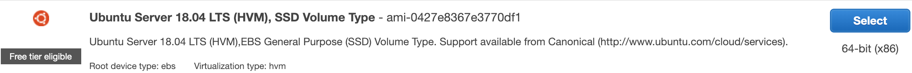
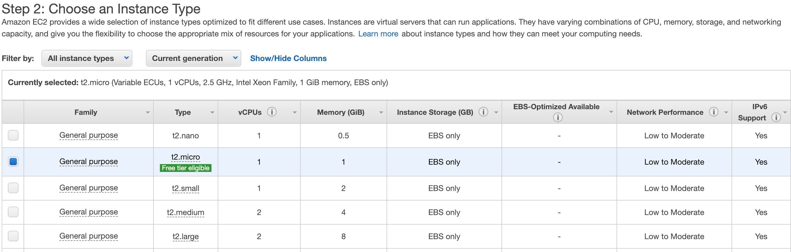
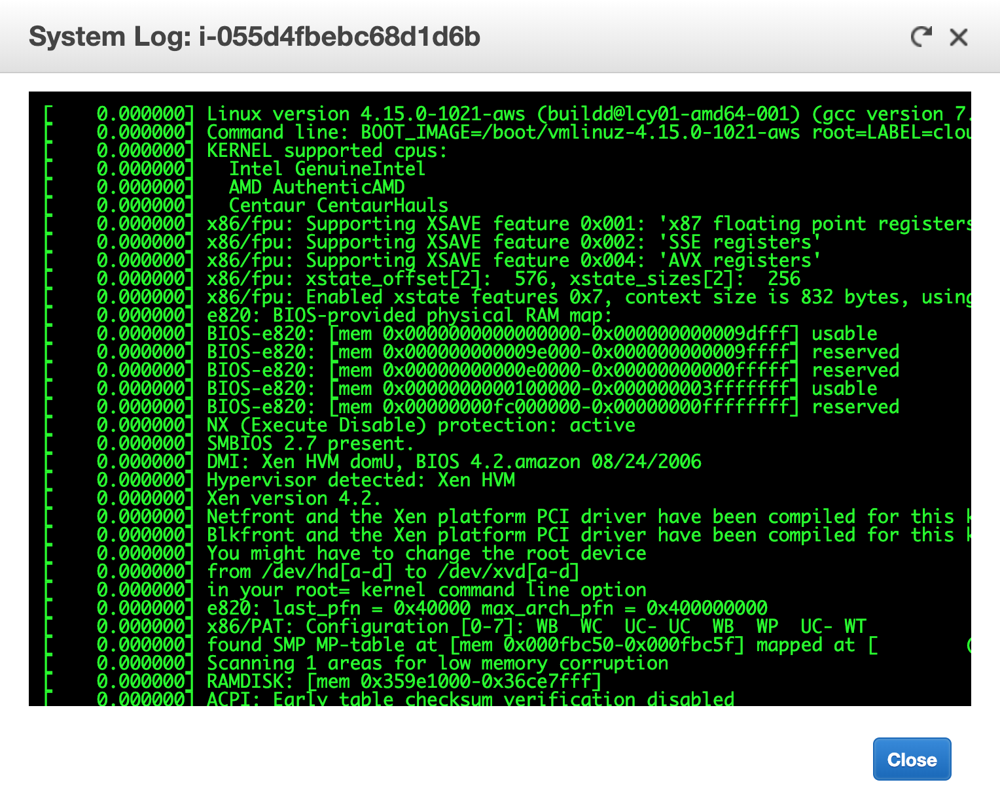
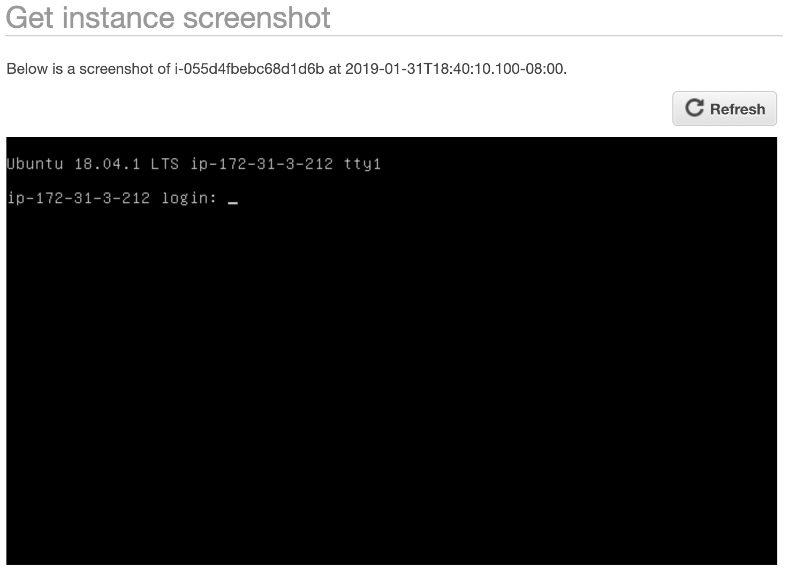
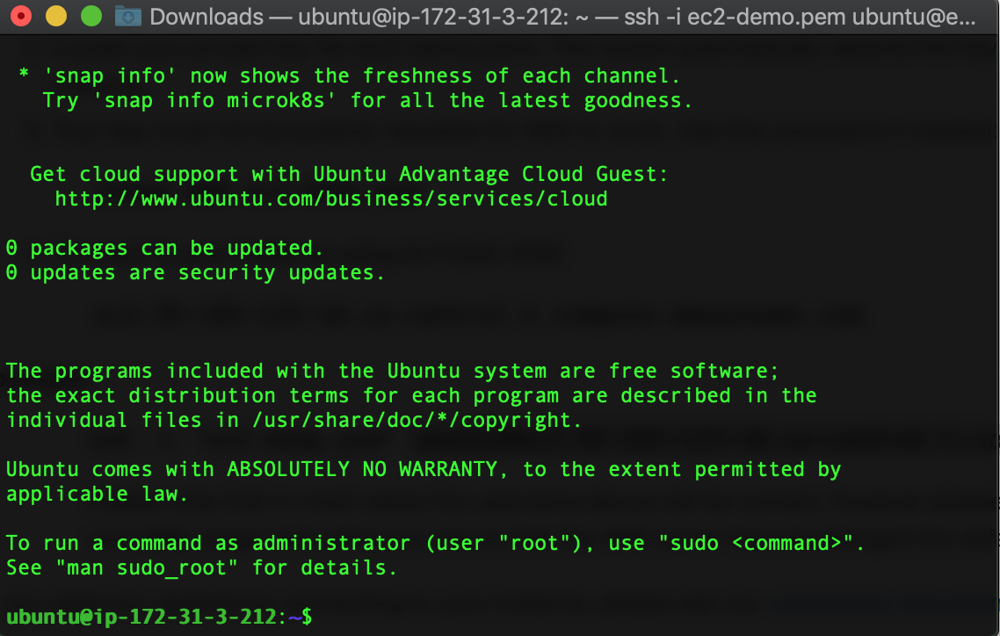

# Lab2 Instruction

-- by Fangyu Gai. Any questions --> fangyu.gai@ubc.ca

---

This lab provides you with a basic overview of launching, monitoring and managing an Amazon EC2 instance.

**Amazon Elastic Compute Cloud (Amazon EC2)** is a web service that provides resizable compute capacity in the cloud.
It is designed to make web-scale cloud computing easier for developers.
For more introduction, refer to [https://docs.aws.amazon.com/AWSEC2/latest/UserGuide/concepts.html](https://docs.aws.amazon.com/AWSEC2/latest/UserGuide/concepts.html).

We have 3 tasks for this lab:

1) Apply for an Amazon AWS account and launch an EC2 instance.

2) Monitor your EC2 instance.

3) Login your EC2 instance via SSH.

## Task 1 Launch Your EC2 Instance

An instance is a virtual server in the AWS Cloud.
You launch an instance from an Amazon Machine Image (AMI).
The AMI provides the operating system, application server, and applications for your instance.

### Sign up for AWS
When you sign up for AWS, you can get started with Amazon EC2 for free using the AWS Free Tier.
You can use the free tier to launch and use a micro instance for free for 12 months.

Follow this link to create your AWS account:
[https://aws.amazon.com/](https://aws.amazon.com/)

Note: You may have to provide your debit/credit card information.
Don't worry about causing money if you stick with this instruction.
But if you launch an instance that is not within the free tier, you incur the standard Amazon EC2 usage fees for the instance.

### Launch an EC2 instance

After the account is set up, we're ready to launch an EC2 instance.

1. Open the Amazon EC2 console at [https://console.aws.amazon.com/ec2/](https://console.aws.amazon.com/ec2/).

2. From the Amazon EC2 console dashboard, choose **Launch Instance**.

3. Now we are on the **Choose an Amazon Machine Image (AMI)** page.

4. To select an AMI that is eligible for the free tier, choose Free tier only in the left pane. For simplicity, let's choose Ubuntu Server  18.04:
    

5. On the **Choose an Instance Type** page, we can choose the type of our instance. Note that for free tier, we have only one choice:
    

6. Click **Review and Launch** button at the bottom of the pape. Then click **Launch** button at the bottom right of the next page.
    > We can also do some configuration of our instance by clicking "Configure Instance Details", but the default setting is enough for this lab.

7. In the **Select an existing key pair or create a new key pair** dialog box, you can choose an existing key pair, or create a new one. Select *Create a new key pair*, name it (for example, "ec2-demo") and download it. After that, click *Launch* to launch your EC2 instance.
    > Important: In the **Select an existing key pair or create a new key pair** dialog box, you can choose an existing key pair, or create a new one

## Task 2 Monitor your EC2 instance

Monitoring is an important part of maintaining the reliability, availability, and performance of your EC2 instances.
This task is to show you several ways to monitor your instance.

1. In your dashboard, select the instance you want to monitor.

2. Click **the Status Checks** tab. Notice that both the *System reachability* and *Instance reachability* checks have passed.

3. Click the **Monitoring** tab. This tab displays CloudWatch metrics for your instance. Currently, there are not many metrics to display because the instance was recently launched. You can click on a graph to see an expanded view.

4. Top of the dashboard, in the **Actions** menu, select **Instance Settings -> Get System Log**.
    
    > The System Log displays the console output of the instance, which is a valuable tool for problem diagnosis. It is especially useful for troubleshooting kernel problems and service configuration issues that could cause an instance to terminate or become unreachable before its SSH daemon can be started. If you do not see a system log, wait a few minutes and then try again.

5. Again, in the **Actions** menu, select **Instance Settings -> Screenshot**. This shows you what your EC2 instance console would look like if a screen were attached to it.
    

## Task 3 Connect your EC2 instance

If you are a Windows user, please go over this video to do this task.

[https://www.youtube.com/watch?v=bi7ow5NGC-U](https://www.youtube.com/watch?v=bi7ow5NGC-U)
>One note is that you should use "ubuntu" as the user name instead of ec2-user.

If you are using Mac or Linux, you should follow the instructions below.
>Your Mac or Linux computer most likely includes an SSH client by default. You can check for an SSH client by typing ssh at the command line. If your computer doesn't recognize the command, the OpenSSH project provides a free implementation of the full suite of SSH tools. For more information, go to [http://www.openssh.org](http://www.openssh.org).

1. In your dashboard page, select the instance you want to connect. Then click **Connect**.

2. In the **Connect your Instance** dialog box, you can see some instructions. Leave this for further use.

3. Open your command line shell and change the directory to the location of the private key file that you created when you launched the instance.

4. Use the chmod command to make sure your private key file isn't publicly viewable. For example, if the name of your private key file is ec2-demo.pem, use the following command:

    ```
    chmod 400 ec2-demo.pem
    ```

5. Use the following SSH command to connect to the instance:

    ```
    ssh -i /path/to/ec2-demo.pem ubuntu@public_dns_name
    ```
    >Note that "/path/to/ec2-demo.pem" is the actual path you stored your ec2-demo.pem, and you can find "public_dns_name" in the instruction box

6. If everything goes well, your computer would be connected to your EC2 instance. Say hello to your EC2 instance!
    
    >You may be asked to add the unknown host, just type "Y" to continue. This may happen when you connect to the remote server for the first time.