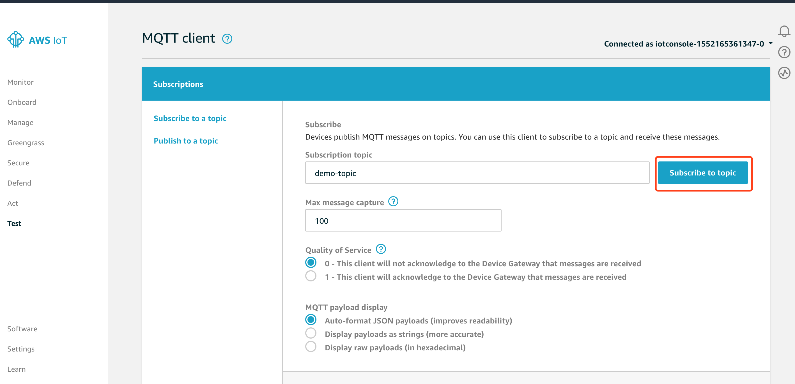

# Lab4 Instruction

-- by Fangyu Gai. Any questions --> fangyu.gai@ubc.ca

---

In lab4, we will connect our Pi to the cloud! This one is going to be tough, so take a deep breath and get started.

Basically, we will use a publiser-subscriber pattern to finish this lab.
Specifically, we use our Pi as a publisher constantly publishing messages about some sort of topic (e.g. temperature).
What's more, we register virtual device on AWS IoT and use it as a subscriber to the particular topic.

## Part 1 Create an AWS IoT Thing for Your Raspberry Pi

A thing represents a device whose status or data is stored in the AWS cloud.
The device's status or data is stored in a JSON document known as the device's shadow.
The shadow is used to both store and retrieve state information.
The Device Shadow service maintains a shadow for each device that is connected to AWS IoT.

### Create an AWS IoT Thing

1. Go to the [AWS IoT console](https://console.aws.amazon.com/iot/home). You may be prompted to sign in.

2. In the AWS IoT console, you see the **Monitor** page. In the navigation pane, choose **Manage**.
    

3. Choose **Create**.
    

4. On the **Creating AWS IoT things** page, choose **Create a single thing**.
    

5. On the **Add your device to the thing registry** page, enter **MyRaspberryPi** for the device **Name**. Leave the default values for all the other fields, and then choose **Next**.
    

6. On the **Add a certificate for your thing** page, choose **Create certificate**. This generates an X.509 certificate and key pair.
    

7. On the **Certificate created!** page, download your public and private keys, certificate, and root certificate authority (CA). Save them on your Raspbery Pi, you will copy them to a different directory later on in this tutorial. Choose **Activate** to activate the X.509 certificate, and then choose **Attach a policy**.
    

8. On the **Add a policy for your thing** page, choose **Register Thing**. After you register your thing, you will need to create and attach a new policy to the certificate.
    

9. On the AWS IoT console, in the navigation pane, choose **Secure** and **Policies**. In the Policies page, choose **Create a policy**.
    

10. On the **Create a policy** page:

    a. Enter a **Name** for the policy. For **Action**,

    b. enter `iot:*`. For Resource **ARN**, enter `*`.

    c. Under **Effect**, choose **Allow**, and then choose **Create**.

    This policy allows your Raspberry Pi to publish messages to AWS IoT.

    > **Note:** These settings are overly permissive. In a production environment narrow the scope of the permissions to that which are required by your device.

    

11. In the AWS IoT console, choose **Manage** and **Things**. On the **Things** page, choose **MyRaspberryPi**.
    

12. On the thing's **Details** page, in the left navigation pane, choose **Interact**.
    

13. Make a note of the REST API endpoint. You will need it to connect to AWS IoT. In the navigation pane, choose **Security**.
    

14. Choose the certificate that you created earlier.
    

15. On the certificate's **Details** page, in **Actions**, choose **Attach policy**.
    

16. On the **Attach policies to certificate(s)** page, choose the policy you created, and then choose **Attach**.
    

## Part2 Setting up Raspberry Pi to connect with AWS IoT

### Preparation

1. Download the Python SDK from [here](https://s3.amazonaws.com/aws-iot-device-sdk-python/aws-iot-device-sdk-python-latest.zip).

2. Rename previous cert files.

    a. Rename AWS Root CA certificate as `aws-root-cert.pem`

    b. Rename the certificate file which we associated with the thing as `iot-cert.pem.crt`

    c. Rename the private key file which we associated with the thing as `private-key.pem.key` (Ignore the public key file).

3. Download the publisher.py code from canvas and make the following changes: In line 7, change **YOUR-THING-END-POINT** to the REST API endpoint (referrence to Step 13 in part 1). This code is to constantly send messages about a topic named "demo-topic".

4. Connect your computer with the raspberry Pi (Refer to Lab3) and maybe you need a monitor to find the IP of the Pi (make sure your computer and the Pi are under the same WiFi). After this, you will no longer need the monitor.

5. In the ssh session, create a new directory named `demo` which specifies our work space by using the following command:

    ```
    mkdir demo
    ```
    Then create other directories `sdk` and `cert` inside `demo`:

    ```
    mkdir demo/cert
    ```
    and 

    ```
    mkdir demo/sdk
    ```
    These directories are to store cert files and Python SDK, respectively.

### Copying files to Raspberry Pi using `scp`

For instruction to copy files to Raspberry Pi by `scp`, refer to [here](https://it.cornell.edu/managed-servers/transfer-files-using-putty) (Windows users) and [here](https://kb.iu.edu/d/agye) (Mac and Linux users).

In this part, you need to copy Python SDK, publisher.py code and cert files into corresponding pathes of the Raspberry Pi from your computer.

Specifically, you need to use `scp` to copy Python SDK to the path `/home/pi/demo/sdk/`, copy publisher.py to the path `/home/pi/demo/` and copy cert files (all of the renamed three cert files) to the path `/home/pi/demo/cert/`.

### Install Python SDK

After copying all of the files above, we need to first install Python SDK which is used in the publisher.py to build connections with the remote AWS IoT server (Fortunately, you don't have to delve into details in this lab).

Use following commands to install Python SDK:

1. Unzip the SDK:
    ```
    unzip /demo/sdk/aws-iot-device-sdk-python-latest.zip
    ```
2. Install
    ```
    sudo python /demo/sdk/setup.py install
    ```

After a while, Python SDK will be installed.

### Executing the publisher and testing

Final step is to run the publisher.py code and test.
Before doing that, we need to let the remote server subscribe the topic.

In the AWS IoT console, navigate to the Test service, click on the **Subscribe** to a topic and named the topic as `demo-topic`.
When you hit the **Subscribe to topic** button we can see what ever the messages are been published by our Raspberry Pi sample publisher program to the demo-topic are getting subscribed by this test service.



Then get back to the ssh session and run the publisher.py code using the command as follows:

```
python /demo/publisher.py
```

If nothing goes wrong, you can see some outputs in the session.
At the same time, you should see some messages being received by the Test service.

